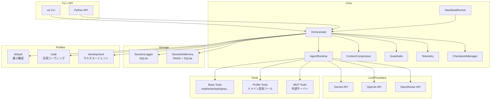

<div align="center">
  <video src="docs/assets/moco-intro.mp4" width="100%" autoplay loop muted playsinline></video>
</div>

> **Open Entity** — Lightweight AI Agent Orchestration

[](https://github.com/ShinjiKimuradascap/open-entity)
[](https://www.python.org/)
[](LICENSE)
[](https://github.com/ShinjiKimuradascap/open-entity/issues)
[](https://github.com/ShinjiKimuradascap/open-entity/releases)

**マルチプロバイダ対応・プロファイルベースの軽量AIエージェントオーケストレーションフレームワーク**

Open Entity は、複数のLLMプロバイダ（Gemini, OpenAI, OpenRouter, Z.ai）に対応し、ドメイン別のプロファイルで複数エージェントの振る舞いを柔軟にカスタマイズできるマルチエージェントオーケストレーションフレームワークです。

## ✨ 特徴

### コア機能
- **🔄 マルチプロバイダ対応**: Gemini, OpenAI, OpenRouter, Z.ai を環境変数またはCLIオプションで切り替え
- **📦 プロファイル機能**: ドメイン別（開発、セキュリティ、税務など）にエージェントとツールをYAMLで定義
- **🤖 マルチエージェント**: 複数のエージェントが協調してタスクを実行、委譲・レビューのワークフロー
- **🧠 セマンティックメモリ**: FAISS による類似度検索で過去の知識・インシデントを自動想起
- **📚 学習メモリ**: 会話から知識を自動抽出・保存、次回の対話で自動想起
- **📝 自動コンテキスト圧縮**: トークン上限に近づくと古い会話を自動要約して圧縮

### CLI & UI
- **💻 リッチCLI**: `oe run`, `oe chat` でターミナルから即座に実行
- **🌐 Web UI**: `oe ui` でブラウザベースのチャットインターフェースを起動
- **📊 タスク管理**: バックグラウンドでタスクを実行、進捗確認、ログ表示
- **📁 セッション管理**: 会話履歴の保存・復元、名前付きセッション

### 開発者向け
- **🔍 コードベース検索**: FAISS によるセマンティック検索でコードを理解
- **🔧 Git統合**: AI生成コミットメッセージ、PR作成
- **🛡️ サンドボックス**: Dockerコンテナ内での隔離実行
- **🔌 MCP対応**: Model Context Protocol で外部ツールサーバーと連携
- **📚 スキル管理**: Claude Skills互換のスキルをインストール・管理

### 安全性
- **🛡️ ガードレール**: 危険なコマンドのブロック、入出力長制限
- **🔒 ループ検出**: 同じツール呼び出しの無限ループを自動検出・停止
- **💾 チェックポイント**: 会話状態を保存し、後から復元可能

## 📋 CLI コマンド一覧

### 基本コマンド

```bash
oe run "タスク"              # タスクを実行
oe chat                      # 対話型チャット（ストリーミング）
oe chat -s my-session        # 名前付きセッションで対話
oe chat --new                # 新規セッションを強制開始
oe ui                        # Web UI を起動
oe version                   # バージョン表示
oe list-profiles             # プロファイル一覧
```

### 対話モード内コマンド (Slash Commands)

チャット実行中に `/` を入力することで、様々な操作が可能です。

*   `/help`: コマンドヘルプを表示
*   `/cd <path|bookmark>`: 作業ディレクトリを変更
*   `/workdir <add|list|remove> [name]`: ブックマーク管理
*   `/ls [path]`: ファイル一覧を表示
*   `/tree [depth]`: ディレクトリ構造を表示
*   `/model [model_name]`: モデルの表示・変更
*   `/profile [profile_name]`: プロファイルの変更
*   `/heartbeat [trigger]`: ハートビート状態表示 / 手動実行
*   `/clear`: 履歴をクリアしてセッション再開
*   `/quit`: チャットを終了

### Web UI

```bash
oe ui                        # http://0.0.0.0:8000 で起動
oe ui -p 3000                # ポート指定
oe ui -h 127.0.0.1           # ホスト指定
oe ui -r                     # 開発モード（自動リロード）
```

### タスク管理（バックグラウンド実行）

```bash
oe tasks run "タスク" -P zai -w /path/to/project  # バックグラウンド実行
oe tasks list                # タスク一覧
oe tasks status              # リアルタイムダッシュボード
oe tasks logs <task_id>      # ログ表示（最大10KB）
oe tasks logs <task_id> -a   # フルログ表示（--all）
oe tasks cancel <task_id>    # キャンセル
```

### セッション管理

```bash
oe sessions list             # セッション一覧
oe sessions show <id>        # セッション詳細
oe run "続き" --continue     # 直前のセッションを継続
oe run "続き" -s my-session  # 名前付きセッションを継続
```

### スキル管理（Claude Skills互換）

```bash
oe skills list               # インストール済みスキル一覧
oe skills info               # 利用可能なレジストリ情報
oe skills sync anthropics    # 公式スキルを同期
oe skills sync community     # コミュニティスキルを同期
oe skills search pdf         # スキル検索
oe skills install <github>   # GitHubからインストール
oe skills uninstall <name>   # アンインストール
```


### 💓 ハートビート（プロアクティブ監視）

ハートビートは組み込みのプロアクティブ監視機構です。エージェントが定期的に起動し、`HEARTBEAT.md` のチェックリストを評価して、注意が必要な場合のみ通知します。

#### 設定

`profiles/<profile>/profile.yaml`:

```yaml
heartbeat:
  enabled: true          # 有効/無効
  interval: 30m          # チェック間隔（30m, 1h, 300s）
  active_hours: "09:00-22:00"  # アクティブ時間帯
  timezone: "Asia/Tokyo"
  ack_token: "HEARTBEAT_OK"    # 正常時の応答トークン
  ack_max_chars: 300
  evolve_every: 5        # N回ごとにチェックリストを自己進化
```

環境変数でのオーバーライド:
```bash
MOCO_HEARTBEAT_ENABLED=true
MOCO_HEARTBEAT_INTERVAL=15m
```

#### HEARTBEAT.md

`profiles/<profile>/HEARTBEAT.md` に配置。エージェントが毎回評価するチェックリスト:

```markdown
# Heartbeat Checklist

以下の項目を定期的にチェックしてください。
全て問題なければ `HEARTBEAT_OK` と返答してください。

## チェック項目

- [ ] 重要なメール・通知の確認
- [ ] カレンダーの直近の予定
- [ ] 実行中のタスクの進捗
```

#### 自己進化

`evolve_every` 回ごとに、エージェントが過去の結果を振り返り、HEARTBEAT.md を自動更新します。常にOKだった項目の削除、アラートが多い項目の改善、新しいチェック項目の追加を行います。

#### CLI コマンド

```bash
oe heartbeat status    # 設定と状態を表示
oe heartbeat trigger   # 手動で1回実行
oe heartbeat edit      # HEARTBEAT.md をエディタで開く
```

チャットモード:
```
/heartbeat             # 状態表示
/heartbeat trigger     # 1回実行
```

#### 動作フロー

1. `oe ui` 起動でハートビートループがバックグラウンドで開始
2. `interval` ごとにエージェントが `HEARTBEAT.md` を読み込み
3. チェックリストを評価（ツールを使って実際の状態を確認）
4. 全て正常 → `HEARTBEAT_OK` で沈黙（通知なし）
5. 注意が必要 → アダプター経由でアラート送信（LINE, Telegram等）
6. N回ごと → 振り返りを行い `HEARTBEAT.md` を書き換え

### オプション

```bash
--profile, -p <name>           # プロファイル指定
--provider, -P <name>          # プロバイダ指定 (gemini/openai/openrouter/zai)
--provider, -P <name/model>    # プロバイダ+モデル一括指定 (例: zai/glm-4.7)
--model, -m <name>             # モデル指定 (例: gpt-4o, gemini-2.5-pro, glm-4.7)
--working-dir, -w <path>       # 作業ディレクトリ
--session, -s <name>           # 名前付きセッション指定
--continue, -c                 # 直前のセッションを継続
--new                          # 新規セッションを強制開始
--sandbox                      # Dockerコンテナ内で隔離実行
--sandbox-image <image>        # サンドボックスイメージ (default: python:3.12-slim)
--stream/--no-stream           # ストリーミング出力（chatはデフォルトON）
--optimizer/--no-optimizer     # Optimizerによるエージェント自動選択（デフォルトOFF）
--verbose, -v                  # 詳細ログ
```

**プロバイダ指定例:**
```bash
oe run "タスク" --provider zai -m glm-4.7        # 別々に指定
oe run "タスク" --provider zai/glm-4.7          # 一括指定（推奨）
oe run "タスク" --provider openrouter -m claude-sonnet-4
```

## 🚀 クイックスタート

### インストール

```bash
# リポジトリをクローン
git clone https://github.com/ShinjiKimuradascap/open-entity.git
cd open-entity

# 依存関係をインストール
pip install -e .

# または pipx で直接インストール
pipx install .
```

### 環境変数の設定

```bash
# .env ファイルを作成
cp .env.example .env
# .env を編集して API キーを設定
```

### 最初の実行

```bash
# タスクを実行
oe run "Hello, World! と表示するPythonスクリプトを作成して"

# プロファイルを指定
oe run "セキュリティ監査を実行" --profile security

# プロバイダを切り替え
oe run "コードをレビューして" --provider openai

# 対話モード
oe chat
```

### 実行中の処理を停止する

- Web UI でチャットを実行中に表示される「停止」ボタンを押すと、そのセッションのストリーミングレスポンスが中断されます。
- バックエンドではセッションごとにキャンセル用のフラグを管理しており、「停止」ボタンは `POST /api/sessions/{session_id}/cancel` を呼び出してフラグを立てます。

## 🏗️ アーキテクチャ



### コンポーネント説明

| コンポーネント | 役割 |
|---------------|------|
| **Orchestrator** | メインエントリポイント。ユーザー入力をエージェントにルーティングし、サブエージェントへの委譲を管理 |
| **AgentRuntime** | 個々のエージェントの実行環境。LLM呼び出しとツール実行を担当 |
| **ContextCompressor** | トークン数監視と自動圧縮。古い会話をLLMで要約 |
| **Guardrails** | 入力/出力/ツール呼び出しの検証。危険パターンのブロック |
| **HeartbeatRunner** | プロアクティブ監視。定期的にHEARTBEAT.mdを評価し、自己進化 |
| **SessionLogger** | 会話履歴のSQLite永続化 |
| **SemanticMemory** | FAISS + Embeddingsによる類似度検索 |
| **CheckpointManager** | 会話状態のスナップショット保存/復元 |

## ⚙️ 設定

### 環境変数

| 変数名 | 説明 | デフォルト |
|--------|------|-----------|
| `GEMINI_API_KEY` | Gemini API キー | - |
| `OPENAI_API_KEY` | OpenAI API キー | - |
| `OPENROUTER_API_KEY` | OpenRouter API キー | - |
| `ZAI_API_KEY` | Z.ai API キー | - |
| `MOONSHOT_API_KEY` | Moonshot API キー | - |
| `LLM_PROVIDER` | デフォルトプロバイダを指定 | 自動選択 |
| `EMBEDDING_PROVIDER` | Embeddingプロバイダ | gemini |
| `EMBEDDING_MODEL` | Embeddingモデル | gemini-embedding-001 |

### プロファイル設定

プロファイルは `profiles/<name>/` ディレクトリで定義します：

```
profiles/my-profile/
├── profile.yaml      # プロファイル設定
├── agents/           # エージェント定義（Markdown）
│   ├── orchestrator.md
│   └── specialist.md
├── tools/            # プロファイル固有ツール（Python）
│   └── custom_tool.py
└── skills/           # スキル定義（Claude Skills互換）
    └── my-skill/
        └── SKILL.md
```

### エージェント組織パターン

`delegate_to_agent` ツールを使って、様々な組織構造を実現できます。

#### 1. 階層型（Hierarchical）

最も基本的なパターン。Orchestrator がサブエージェントにタスクを委譲。

```
orchestrator
├── @backend-coder  → バックエンド実装
├── @frontend-coder → フロントエンド実装
└── @code-reviewer  → コードレビュー
```

#### 2. 並列型（Parallel）

複数のエージェントが同時に独立して作業。

```markdown
@backend-coder APIを実装して
@frontend-coder UIを実装して
@unit-tester テストを作成して
```

Open Entity は自動的に並列実行し、すべての結果を集約します。

#### 3. パイプライン型（Sequential）

処理結果を次のエージェントに渡すチェーン。

```
@api-designer → @backend-coder → @unit-tester → @code-reviewer
```

## 🔧 ツール一覧

### ベースツール

| ツール名 | 説明 | エイリアス |
|----------|------|-----------|
| `read_file` | ファイルを読み込む | `read` |
| `write_file` | ファイルを書き込む | `write` |
| `edit_file` | ファイルを部分編集 | `edit` |
| `execute_bash` | Bashコマンドを実行 | `bash` |
| `list_dir` | ディレクトリ一覧 | - |
| `glob_search` | Globパターン検索 | - |
| `grep` | 正規表現検索 | - |
| `websearch` | Web検索 | - |
| `webfetch` | Webページ取得 | - |
| `todowrite` | TODOリスト書き込み | - |
| `todoread` | TODOリスト読み込み | - |

### スキルツール

| ツール名 | 説明 |
|----------|------|
| `search_skills` | スキルを検索（ローカル + リモート） |
| `load_skill` | スキルをロードして知識を使用 |
| `list_loaded_skills` | ロード済みスキル一覧 |

## 🧠 学習メモリ機能

Open Entity は会話から知識を自動的に学習し、次回の対話で活用します。

### 機能概要

| 機能 | 説明 |
|------|------|
| **recall** | プロンプト前に関連記憶を検索（ハイブリッド検索: embedding + keyword） |
| **learn** | 会話から知識を抽出して保存（重複・矛盾チェック付き） |
| **record_task_run_event** | ツール実行をログに記録 |

### 使用例

```bash
# 情報を教える
oe run "経費精算は田中さんに聞いてね"

# 後で質問すると、学習した内容を活用
oe run "経費精算どこに聞けばいい？"
# → 「田中さんに聞いてください」と回答
```

## 📄 ライセンス

MIT License

Copyright (c) 2024-2026 Open Entity Team
